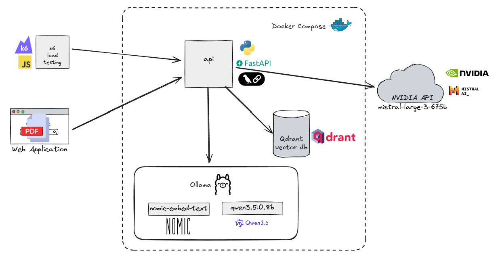

# RAG MPM - система для методологии 3D прогнозирования минерализации

Королев Юрий РИС-25-1м

RAG на FastAPI, Qdrant, Ollama и NVIDIA API для вопросов по методологии MPM.

## Архитектура проекта

## Стек

| Компонент | Технология |
| --- | --- |
| API | FastAPI, Uvicorn |
| Векторная БД | Qdrant |
| Эмбеддинги | Ollama `nomic-embed-text` |
| LLM локальный | Ollama `qwen3.5:0.8b` |
| LLM облачный | NVIDIA API `mistral-large-3` |
| Чанкинг | LangChain `RecursiveCharacterTextSplitter` |
| Контейнеризация | Docker Compose |

## API

### POST `/upload`

Загрузка PDF, чанкинг, эмбеддинги, запись в Qdrant.

### POST `/search`

Поиск по эмбеддингам без LLM.

### POST `/ask/ollama`

RAG со стримингом через Ollama `qwen3.5:0.8b`.

### POST `/ask/nvidia`

RAG со стримингом через NVIDIA API.